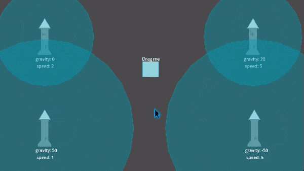

<p align="center">
  
</p>

<h1 align="center">
  Godot ProjectileOnCurve2D Plugin
</h1>

## About

The plugin allows you to create 2d projectiles that moves toward the target on curve with gravity adjustment.


## Features

- Adjusting the angle of a curve
- Changing the projectile speed without affecting the trajectory
  
> The trajectory is calculated only based on gravity, initial and target positions.


## Requirements 

- Godot 4.2 or higher


## Installation

- Open the `AssetLib` tab in Godot with your project open.
- Search for "ProjectileOnCurve2D Plugin" and install the plugin by Mero.
- Once the download completes, deselect "demo" if you don't need the example scene.
- Open project settings -> plugins, and enable the plugin "ProjectileOnCurve2DPlugin".
- Done!


## Usage
  
> The "ProjectileOnCurve2D" node can be both a root or subnode in your projectile scene. It does not force a specific node structure, allowing you to create projectiles with any logic and structure needed. Below are a couple of approaches for creating a projectile using "ProjectileOnCurve2D" as a starting point.

1. Install the plugin
2. Enable the plugin in Godot (Project -> Project Settings -> Plugins Tab)
3. Use the new node type "ProjectileOnCurve2D" to create projectiles
4. Call `launch` method on "ProjectileOnCurve2D" to start the movement

```
newProjectile.launch(initialGlobalPosition, targetGlobalPosition, gravity, speed)
```


### Using "ProjectileOnCurve2D" as root node

> This approach has been used in the demo where you can find code example of this concept

In this approach the root node will move it self to the target and provide `launch` function to start the projectile motion. The appearance, collision etc. should be implemented by subnodes


### Using "ProjectileOnCurve2D" as subnode

If you need your projectile root node to be of any other type (such as Area2D, Sprite2D etc.) your way is to add "ProjectileOnCurve2D" as subnode and extend it's script (or create new any 2D node and extend it's script from "ProjectileOnCurve2D") where you need to synchronize the movement between "ProjectileOnCurve2D" and your projectile scene depending on your goals. 

The "ProjectileOnCurve2D" is moving it self so to make it move your entire projectile scene or a certain nodes you need to overload the `_physics_process` and use the "ProjectileOnCurve2D" `position` in your purposes:

```
_physics_process(delta):
  # the "ProjectileOnCurve2D" motion
  super._physics_process(delta)

  # move the needed node with the "ProjectileOnCurve2D"
  owner.position = position
```


## Demo

> Note: don't forget to check "Requirements" & "Usage" sections.

- Install the plugin and leave "demo" folder as selected
- Open "demo/towersDemo.tscn" scene
- Adjust towers projectile params and run the scene

> If you have already installed the plugin without the "demo" folder, just download it from the current repository and place it in your project, all other steps remain the same.


## Demo Preview 


