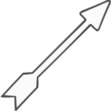
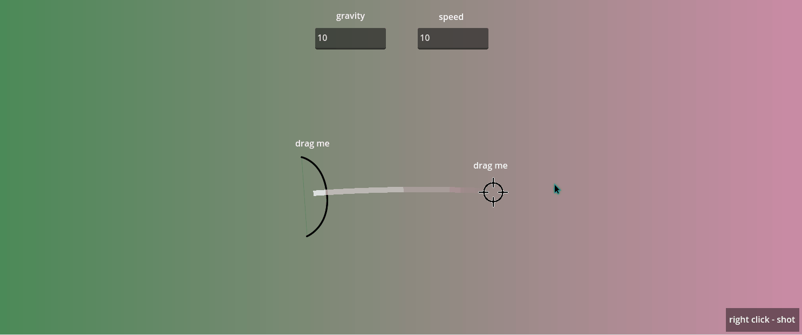
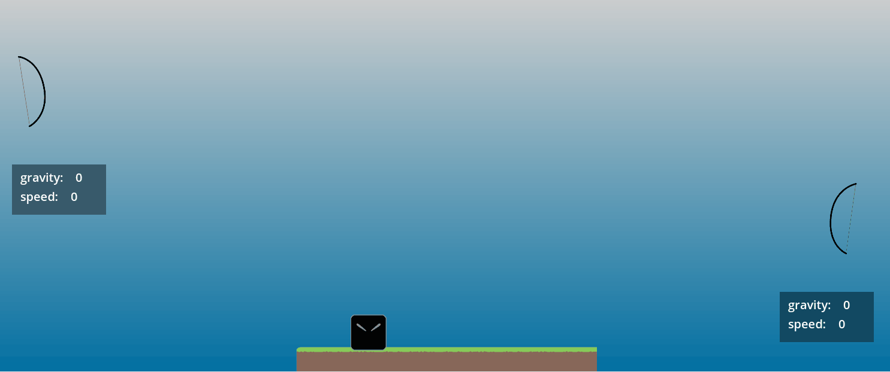
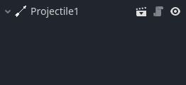
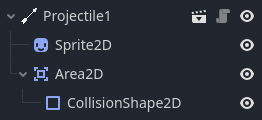

<p align="center">
  
</p>

<h1 align="center">
  Godot ProjectileOnCurve2D Plugin
</h1>

<p align="center">
  <a href="https://ko-fi.com/I2I31KH5HB" target="_blank">
    
  </a>
</p>

## See my other plugins

- [Android Internet Connection State](https://github.com/MeroVinggen/Godot-AndroidInternetConnectionStatePlugin)
- [
Vector2 editor](https://github.com/MeroVinggen/Godot-Vector2ArrayEditorPlugin)
- [Threaded Resource Save-Load](https://github.com/MeroVinggen/Godot-ThreadedResourceSaveLoadPlugin)

## About

The plugin allows you to create 2d projectiles that moves toward the target on curve with arc height adjustment.


## Demo Preview 





## Features

- Adjusting the angle of a curve by manipulating the projectile arc height
- Changing the projectile speed without affecting the trajectory
- Projectile auto rotation along the curve


## Requirements 

- Godot 4.0 or higher
  
> [!IMPORTANT]
> This project uses Godot 4.4.1. You can edit it with Godot 4.2+, but the addon works from 4.0+


## Installation

- Open the `AssetLib` tab in Godot with your project open.
- Search for "ProjectileOnCurve2D Plugin" and install the plugin by Mero.
- Once the download completes, deselect "demo" if you don't need the example scene.
- Open project settings -> plugins, and enable the plugin `ProjectileOnCurve2D`.
- Done!


## Usage

> [!TIP]
> You may find projectile scene example in the project at "res://demo/shared/projectile/"

1. Create new projectile scene by inheriting the `ProjectileOnCurve2D` scene



> [!TIP]
> You can use `ProjectileOnCurve2D` as subnode for your projectiles, this is covered in [Using as subnode](#using-projectileoncurve2d-as-subnode-less-performant)

2. Add nodes for visual representation and collision handing



3. extend the root script to add the projectile logic

```gdscript 
# connect `area_entered` signal of `Area2D` node to this func

func _on_area_entered(_area: Area2D) -> void:
  # destroy projectile on collision
  queue_free() 
```

4. Instantiate the projectile and call `launch` to start the movement

```gdscript 
# in your test scene

var projectile1: PackedScene = load(<path to your projectile scene>)

func shot() -> void:
  var newProjectile: ProjectileOnCurve2D = projectile1.instantiate()
  newProjectile.launch(startPos, targetPos, arcHeight, speed)
  add_child.call_deferred(newProjectile)
```

### Methods

- `launch(startPos, targetPos, arcHeight, speed)` - projectile launch
  - `startPos` - start movement position
  - `targetPos` - movement target position (projectile won't stop if reaches it)
  - `arcHeight` - controls the height of the visual arc (higher values make the curve more pronounced; zero makes it a straight line, you can see it in [demo preview](#Demo-Preview))
  - `speed` - projectile velocity (doesn't affect the trajectory)

- `stop()` - pause motion
- `move()` - resume motion
- `step(delta: float)` - manual motion step call

> [!IMPORTANT]
> `ProjectileOnCurve2D` is moving during `physics` ticks

> [!WARNING]
> The `ProjectileOnCurve2D` changes its `scale.y` when the target is to its left


### Using `ProjectileOnCurve2D` as subnode (less performant)

If you need your projectile root node to be of any other type (such as Area2D, Sprite2D etc.) your way is to add `ProjectileOnCurve2D` as subnode and extend it's script, where you need to synchronize the movement between `ProjectileOnCurve2D` node and your projectile scene, depending on your goals. 

The `ProjectileOnCurve2D` is moving, rotating and scaling it self so to make it move your entire projectile scene or a certain nodes - you need to inherit and overload the `_physics_process` and use the `ProjectileOnCurve2D` transformations in your purposes:

```gdscript
_physics_process(delta):
  # the `ProjectileOnCurve2D` motion
  super._physics_process(delta)

  # sync transformations of your root node with the `ProjectileOnCurve2D`
  owner.position = position
  owner.rotation = rotation
  # caution! the `ProjectileOnCurve2D` changes its scale.y when target is from the right side
  owner.scale = scale
```

Sure thing you may sync only position and handle rotation/scale manually.


## Demo

> [!WARNING]
> Don't forget to check [Requirements](#Requirements) section

- Install the plugin and leave "demo" folder as selected
- Launch "res://demo/2 bows targeting mob on ground/2 bows targeting mob on ground.tscn" or "res://demo/BowWithAim/BowWithAim.tscn" scene

> [!TIP]
> If you have already installed the plugin without the "demo" folder, just reinstall it or download the "demo" folder from the current repository and place it in your project, all the other steps remain the same
